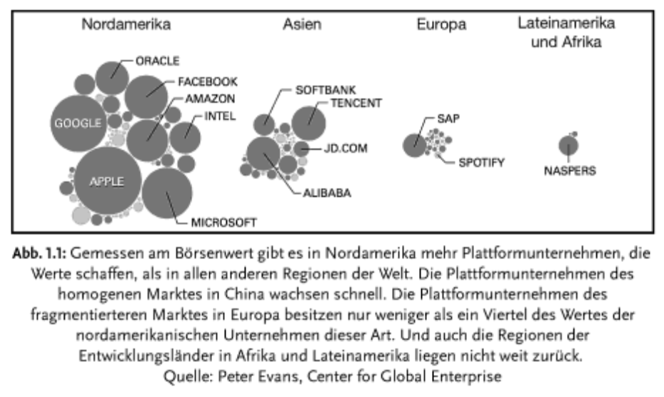
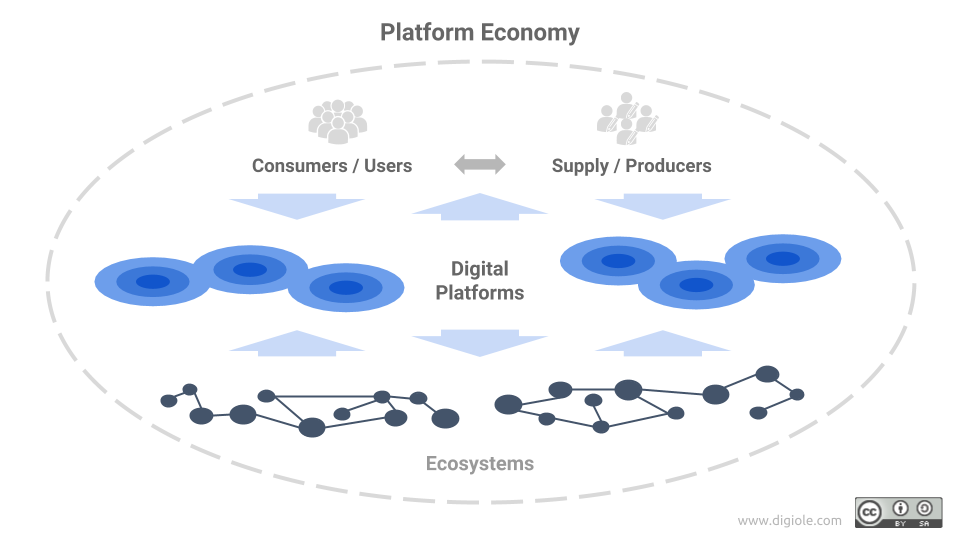
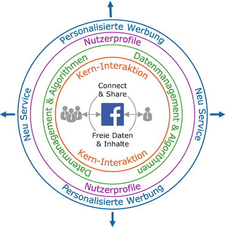
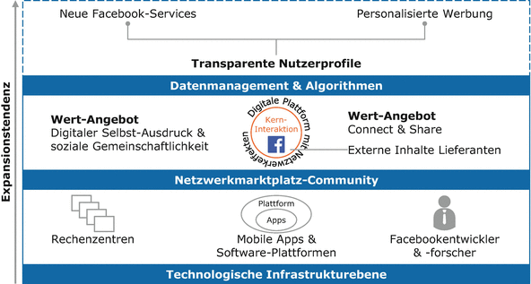
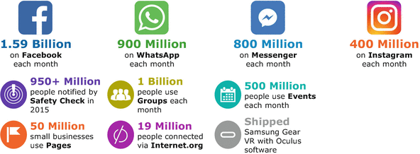
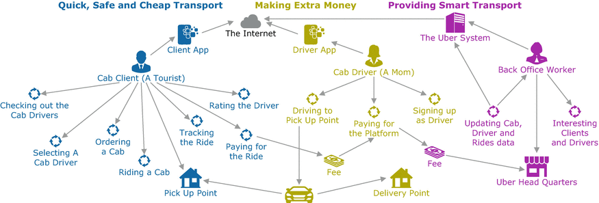

<!--
author:   André and Fabio

email:    info@fysiweb.com

version:  0.0.1

language: de

narrator: Deutsch Female

logo: https://upload.wikimedia.org/wikipedia/commons/d/d2/Internet_map_1024.jpg

comment: todo


@abbr: <abbr title="@1">@0</abbr>

@TCP:     @abbr(TCP,Transmission Control Protocol)
@IP:      @abbr(IP,Internet Protocol)
@DNS:     @abbr(DNS,Domain Name System)
@ARPAnet: @abbr(ARPAnet,Advanced Research Projects Agency Network)
@WWW:     @abbr(WWW,World Wide Web)
@CERN:    @abbr(CERN,Conseil Européen pour la Recherche Nucléaire)
@HTML:    @abbr(HTML,Hypertext Markup Language)
@HTTP:    @abbr(HTTP,Hypertext Transfer Protocol)

@IPFS:    @abbr(IPFS,InterPlanetary File System)
@WebDAV:  @abbr(WebDAV,Web-based Distributed Authoring and Versioning)


@style:   <!--style="width: 100%; max-width: 80vh; margin: 10px auto 20px; display: block;"-->
-->

# Die Macht der digitalen Plattformen


## Vorab

Wie alt ist das Internet?

    [( )] 12 Jahre
    [( )] 22 Jahre
    [( )] ca. 34 Jahre
    [(X)] über 50 Jahre

---

Wann wurde die erste Email versandt?

    [(X)] 20. Juli 1971
    [( )] 30. Februar 1982
    [( )] 3. Oktober 1989


## 1969 - 1983 (@ARPAnet)

* Dezentrales Netzwerk zur Verbindung von Großrechnern an US-amerikanischen
  Universitäten (ursprünglich):

  1. University of California, Los Angeles (UCLA)
  2. University of California, Santa Barbara (UCSB)
  3. Stanford Research Institute (SRI International)
  4. University of Utah (UU))

* Konzept:

  - "Intergalactic Computer Networt" wurde ursprünglich abgelehnt
  - ab 1969 finanzierung durch die DARPA
  - Verbindung über Telefonleitung
  - Paketvermittlung

* ab 1973 auch in Europa

* Probleme:

  - Zumeist manuelle Adressverwaltung
  - Noch wenig Ausfalltolerant
  - Verknüpfung verschiedener Netze

@style

## 1981 - 1993 (@TCP/@IP, @DNS)

Wie funktioniert unser heutiges Internet?
=========================================

Kommunikation im Internet wird in unterschiedlichen Schichten (layer)
organisiert. Dabei muss die folgende Abbildung von unten nach oben gelesen
werden:

``````````````

   .---------------+---------+----------------------------------------.
   |               |         |  💻   |--( $ dig google.de )---->|  📖   |
   | 4. Anwendung  |  "@DNS" |      |                          |      |
   |               |         |      |<-----( 216.58.212.131 )--|      |
   +---------------+---------+----------------------------------------+
   | 3. Transport  |  "@TCP" | [📫  Rechner1] <-- 📨  --> [📬  Rechner2] |
   +---------------+---------+----------------------------------------+
   | 2. Internet   |  "@IP"  | 192.0.2.42 / 2001:db8:34e:...:370:7347 |
   +---------------+---------+----------------------------------------'
   | 1. Netzzugang |  ...    | 🔌                                      |
   '---------------+---------+----------------------------------------'
``````````````

    --{{1}}--
Die unterste Ebene beschreibt den direkten physischen Zugriff zu einem Netzwerk,
dieser kann direkt über ein Kabel erfolgen (Ethernet, CAN), Funk (WLAN, Bluetooth,
...), Infrarot, etc.

    --{{2}}--
Damit zwei Rechner auch über weite Instanzen Informationen austauschen können,
benötigen sie eine einheitliche Adresse oder anders gesagt, eine Telefonnummer.
Um diese Adressierung sowie das "Routing", sprich die Vermittlung der Pakete
kümmert sich das so genannten Internet Protocol (oder kurz gesagt @IP). Jedes
Gerät, das auf das Internet zugreift benötigt eine solche Adresse.

    --{{3}}--
Der koordinierte Austausch von Informationen oder anders gesagt Datenpaketen
wird über das [Transport Control Protocol]() (kurz @TCP) organisiert. Dabei ist es
hier noch vollkommen egal ob es sich dabei um Bilder, Kontoauszüge, Webseiten,
etc. handelt. @TCP zerstückelt diese Daten in handliche Pakete und baut sie beim
Gegenüber wieder auf. Sollte es hier zu Übertragungsfehlern kommen, so wird die
Wiederübertragung gestartet.

    --{{4}}--
Eine zentrale Anwendung des Internets bilded das so genannte Domain Name System
(kurz @DNS). Dabei handelt es sich um das zentrale Register des Internets oder
vereinfacht gesagt eine art Telefonbuch, es übersetzt die von Menschen leicht
lesbaren Adressen wie www.google.de in @IP-Adressen.


## 1989 - heute (@WWW)

    --{{1}}--
Das was wir vermeintlich Internet nennen ist das so genannte World Wide Web und
wurde von Tim Berners-Lee zwischen 1989 und 1994 am @CERN entwickelt.
*Mit seiner Vision, das Wissen der Menschheit durch Vernetzung und Dezentralisation frei zugänglich zu machen, revolutionierte Berners-Lee die Welt.*
Das ursprüngliche Ziel dabei war es Forschungsergebnisse über das Internet
dezentral zu organisieren, miteinander zu verknüpfen (über sogenannte
Hyperlinks) und direkt abrufbar zu machen.


> @style
>
> -- Tim Berners-Lee der Erfinder des World Wide Webs


    --{{2}}--
Es bestand und besteht im Grunde aus zwei Teilen, einer Beschreibungssprache
@HTML zum sturkturierten Ablegen von Informationen und dem @HTTP Protokoll zum
übertragen von Webseiten.
_Oder wie es früher genannt wurde, Hypertext-Dokumenten_
Ursprünglich wurden Webseiten noch in dieser textuellen Form gelesen und
erstellt.

    {{2}}
1. @HTML: Hypertext Markup Language

   ``` html
   <!DOCTYPE html>
   <html>
     <head>
       <title>Titel der Webseite</title>
       <!-- weitere Kopfinformationen -->
       <!-- Kommentare werden im Browser nicht angezeigt. -->
     </head>
     <body>
       <p>Inhalt der Webseite</p>
     </body>
   </html>
   ```
2. @HTTP: Hypertext Transfer Protocol

   ```
   HTTP/1.1 200 OK
   Server: Apache/1.3.29 (Unix) PHP/4.3.4
   Content-Length: 123456 (Größe von infotext.html in Byte)
   Content-Language: de (nach RFC 3282 sowie RFC 1766)
   Connection: close
   Content-Type: text/html
   ...
   ```

    --{{3}}--
Der erste grafische Browser hieß ebenfalls
[WorldWideWeb](https://de.wikipedia.org/wiki/WorldWideWeb) und wurde auch von
Tim Berners-Lee entwickelt. Er diente sowohl zum Darstellen von Webseiten, war
aber auch gleichzeitig ein Editor für @HTML Dokumente.

    {{3}}
@style


### [Gopher](https://de.wikipedia.org/wiki/Gopher)

    --{{0}}--
Man muss erwähnen, dass das es neben dem @WWW auch andere Versuche gab und gibt
Informationen in strukturierter Art und Weise abzulegen und miteinander zu
verknüpfen. [Gopher](https://de.wikipedia.org/wiki/Gopher) war/ist einer
bekanntesten Kontrahenten der in vielen Punkten mit dem Ansatz von Tim
Berners-Lee vergleichbar ist.


<!-- style="width: 100%" -->


## heute - Web 2.0

    --{{0}}--
Zusammenfassend lässt sich sagen, dass das Internet mit dem @WWW als
Killerapplikation einen ähnlichen gesellschaftlichen Umbruch markieren wie die
Erfindung des Buchdrucks. Das Internet wurde Grundlegend als dezentrales System
entworfen und entwickelt, wobei das @WWW ursprünglich nur den **freien** Zugriff
auf Informationen bereitstellen sollte die von jedem **gleichberechtig**
eingesehen und veröffentlicht werden können.


<iframe src="https://internet-map.net" style="width: 100%; height: 82%"></iframe>


    --{{1}}--
Das Internet ist zu schnell gewachsen, technisch für die meisten Leute viel zu
kompliziert und teuer geworden. Über den Internetbrowser lassen sich gängige
Webseiten wie „Amazon“ oder „eBay“ sehr kompfortabel abrufen und durchsuchen.
Aber diese "offenen", leicht zugänglichen Plattformen bilden nur die sichtbare
Oberfläche des World Wide Webs.


## Digitale Plattformen
TODO: Begriffe Digital und Plattform

### Web Plattformen

<!-- data-type="barchart" -->
| Site                | Daily Time on Site | Daily Pageviews per Visitor | % of Traffic From Search | Total Sites Linking In | Eigentümer                   | Beschreibung                   |
| ------------------- | ------------------:| ---------------------------:| ------------------------:| ----------------------:| ---------------------------- | ------------------------------ |
| Google.com          |              16.23 |                       17.48 |                   0.30 % |                1300441 | Google LLC                   | Suchmaschine                   |
| Youtube.com         |              18.15 |                       10.13 |                  14.30 % |                 988820 | Google LLC                   | Videoportal                    |
| Tmall.com           |               7.15 |                        3.98 |                   1.00 % |                   6212 | Alibaba Group                | Online-Marktplatz              |
| Baidu.com           |               7.18 |                        4.98 |                   6.20 % |                 101279 | Baidu Inc.                   | Suchmaschine                   |
| Qq.com              |               3.71 |                        3.94 |                   3.00 % |                 262198 | Tencent Holdings Ltd.        | Instant-Messaging-Dienst       |
| Sohu.com            |               3.63 |                        4.54 |                   2.20 % |                  25945 | Sohu.com Inc.                | Infotainment-Portal            |
| Taobao.com          |               4.53 |                        3.51 |                   3.80 % |                  24826 | Alibaba Group                | Online-Marktplatz              |
| 360.cn              |               3.32 |                        4.17 |                   0.40 % |                  14998 | Qihoo 360 Technology Co. Ltd | Antivirenprogramm              |
| Facebook.com        |              18.48 |                        8.84 |                   8.90 % |                2181031 | Facebook Inc.                | Soziales Netzwerk              |
| Jd.com              |               3.52 |                        4.38 |                   1.50 % |                   8481 | JD.com, Inc.                 | Online-Marktplatz              |
| Yahoo.com           |               5.47 |                        4.97 |                   9.30 % |                 319186 | Yahoo! Inc.                  | Infotainment-Portal            |
| Amazon.com          |              10.45 |                        9.78 |                  19.40 % |                 363277 | Amazon.com, Inc.             | Online-Marktplatz              |
| Wikipedia.org       |               3.78 |                        3.10 |                  74.00 % |                 763999 | Wikimedia Foundation Inc.    | Online-Enzyklopädie            |
| Weibo.com           |               3.05 |                        3.52 |                   1.80 % |                  68824 | Sina Corporation             | Mikroblogging-Dienst           |
| Zoom.us             |               7.83 |                        3.77 |                  13.30 % |                   3009 | Zoom Video Communications    | Videokonferenz                 |
| Sina.com.cn         |               2.87 |                        3.33 |                   3.00 % |                  45672 | Sina Corporation             | Infotainment-Portal            |
| Xinhuanet.com       |               2.97 |                        5.70 |                   2.50 % |                  34113 | Volksrepublik China          | Staatliche Nachrichtenagentur  |
| Live.com            |               5.47 |                        5.53 |                  10.00 % |                  43223 | Microsoft Corporation        | Infotainment-Portal            |
| Reddit.com          |               5.88 |                        4.57 |                  35.20 % |                 163041 | Advance Publications         | Online-Community               |
| Netflix.com         |               4.55 |                        3.27 |                   9.40 % |                  10865 | Netflix, Inc.                | Videoportal                    |
| Microsoft.com       |               4.38 |                        3.30 |                  26.70 % |                235 680 | Microsoft Corporation        | Onlinehändler                  |
| Panda.tv            |               2.82 |                        5.33 |                   0.80 % |                    340 |                              | Streamingdienst insbes. Gaming |
| Zhanqi.tv           |               2.85 |                        5.38 |                   0.80 % |                    334 |                              | Streamingdienst insbes. Gaming |
| Office.com          |              10.98 |                       10.25 |                   6.90 % |                   5767 | Microsoft Corporation        | Online-Office                  |
| Alipay.com          |               3.06 |                        3.19 |                   1.50 % |                   3513 | Alibaba Group                | Online-Zahlungssystem          |
| Okezone.com         |               4.05 |                        4.22 |                   7.20 % |                  10399 |                              | Infotainment-Portal            |
| Instagram.com       |               8.80 |                       10.06 |                  14.50 % |                 622099 | Facebook Inc.                | soziales Netzwerk              |
| Vk.com              |               7.12 |                        3.71 |                   9.30 % |                 124054 | Mail.Ru Group                | soziales Netzwerk              |
| Csdn.net            |               3.35 |                        4.86 |                   8.10 % |                   6438 |                              | Infotainment-Portal            |
| Myshopify.com       |              21.17 |                       13.48 |                   3.10 % |                    118 | Shopify                      | E-Commerce-Software            |
| Microsoftonline.com |               1.08 |                        1.85 |                   2.90 % |                    677 | Microsoft Corporation        | Software as a Service          |
| Yahoo.co.jp         |              10.08 |                        9.00 |                  14.10 % |                  57560 | Yahoo! Inc.                  | Infotainment-Portal            |
| Bing.com            |               3.25 |                        2.63 |                   5.90 % |                  41693 | Microsoft Corporation        | Suchmaschine                   |
| Twitch.tv           |               7.78 |                        3.85 |                   7.10 % |                   9771 | Amazon.com, Inc.             | Videoportal                    |
| Google.com.hk       |               3.75 |                        5.25 |                   3.30 % |                   9758 | Google LLC                   | Suchmaschine                   |
| Bongacams.com       |               3.08 |                        1.61 |                   6.70 % |                 178712 | BongaCams                    | Pornografie im Internet        |
| Naver.com           |              13.98 |                       11.20 |                   9.90 % |                  38994 | Naver Corporation            | Suchmaschine                   |
| Ebay.com            |               9.63 |                        7.80 |                  17.80 % |                  74970 | eBay Inc.                    | Online-Marktplatz              |
| Tianya.cn           |               2.93 |                        5.05 |                   0.70 % |                   5200 |                              | Internet-Forum                 |
| Adobe.com           |               3.04 |                        3.27 |                  20.30 % |                 244100 | Adobe Inc.                   | Software                       |
| Aliexpress.com      |               9.97 |                        8.38 |                  14.40 % |                  18807 | Alibaba Group                | Onlinehändler                  |
| Yy.com              |               2.78 |                        5.19 |                   0.90 % |                   2120 |                              |                                |
| Huanqiu.com         |               2.85 |                        5.23 |                   1.10 % |                   6324 |                              | Infotainment-Portal            |
| Amazon.in           |              12.25 |                       10.25 |                  26.00 % |                   6673 | Amazon.com, Inc.             | Onlinehändler                  |
| Twitter.com         |              12.83 |                       10.60 |                  11.70 % |                1578393 | Twitter Inc.                 | Mikroblogging-Dienst           |
| Amazon.co.jp        |               8.58 |                        9.55 |                  18.20 % |                  48782 | Amazon.com, Inc.             | Onlinehändler                  |
| Aparat.com          |               6.60 |                        5.18 |                  42.30 % |                  66504 |                              | Videoportal                    |
| So.com              |               3.82 |                        3.47 |                   1.00 % |                   7719 |                              |                                |
| Chaturbate.com      |              11.06 |                        8.43 |                   9.00 % |                 156661 | Chaturbate                   | Pornografie im Internet        |
| Github.com          |               6.63 |                        6.57 |                  27.30 % |                  40565 | Microsoft Corporation        |                                |

Quellen:

1. Alexa.com: [The top 500 sites on the web](https://www.alexa.com/topsites/)
2. Wikipedia: [Liste der meistaufgerufenen Websites](https://de.wikipedia.org/wiki/Liste_der_meistaufgerufenen_Websites#cite_note-1)


### Digitale Plattformunternehmen

--{{0}}--
In Realität sieht es ein wenig anders aus. Einzelne Unternehmen dominieren den digitalen Markt.


@style


### Kapitalisierung digitaler Plattformen

--{{0}}--
Gemessen am Börsenwert gibt es in Nordamerika mehr Plattformunternehmen, die Werte schaffen, als in allen anderen Regionen der Welt. Die Plattformunternehmen des homogenen Marktes in China wachsen schnell. Die Plattformunternehmen des fragmentierten Marktes in Europa besitzen nur weniger als ein Viertel des Wertes der nordamerikanischen Unternehmen dieser Art. Un auch die Regionen der Entwicklungsländer in Afrika und Lateinamerika liegen nicht weit zurück.


<!-- data-title="Worldwide market capitalisation of digital platforms (e.g. Uber, Facebook etc) as of 2015" data-show -->
| Region             | US Dollar (Milliarde) |
| ------------------ | ---------------------:|
| Vereinigte Staaten |                3350.0 |
| Asien              |                 854.0 |
| Europa             |                 128.0 |
| Afrika             |                  74.0 |
| Süd Amerika        |                  13.5 |


<!-- @style -->

Quelle:
Peter Evants, Center for Global Enterprise


#### Startups

Sie sind die erfolgreichsten deutschen Investoren im Internet: die drei Brüder
Oliver, Marc und Alexander Samwer. Mit dem Online-Modehaus Zalando bauten sie
einen Milliardenkonzern auf. Wimdu und home24 sind weitere Firmen, bei denen sie
die Fäden ziehen.

“Die Start-up-Fabrik „Rocket Internet“ der Samwer-Brüder hat eine ganz eigene
Antwort auf die digitale Disruption gefunden. Sie entwickelten eine Methode, im
Markt erfolgreiche digitale Geschäftsmodelle zu kopieren und über eine digitale
Plattform auszurollen.”

### Digitale Plattform Wirtschaft

@style


> “Im Gegensatz zu vielen anderen Autoren erkennt der bereits zitierte
> Internetblogger Sascha Lobo die Sprachnot der Digitalisierung, wenn er
> schreibt: „Man sagt Internet, aber Apps gehören in der Regel nicht dazu. Man
> sagt Netz, aber Android kann damit kaum gemeint sein. Man sagt Web, aber
> Ebooks haben damit wenig zu tun. Aber Begriffe prägen Diskussionen und damit
> die zukünftige Entwicklung.“ So schlägt Lobo dann vor: „… deshalb soll der
> Begriff ,Digitale Sphäre ‘ für alles stehen, was elektronisch und datenbasiert
> funktioniert”
>
> Excerpt From: Michael Jaekel. “Die Macht der digitalen Plattformen.” Apple Books.

### Digitale Plattform Case Studies

#### Facebook Case Study

@style
@style
@style

“3.5 Auf dem Weg zur digitalen Identität – Facebook Case Study Vielleicht kennen
einige Leser noch die untergegangene digitale Plattform „My Space “, die in der
Prä-Facebook-Ära das dominierende soziale Medium darstellte. Die als
Visitenkarte für junge Musikbands konzipierte digitale My Space-Plattform war
offen gestaltet und ohne zu viele Vorgaben für die Nutzer. Die Nutzer konnten so
ihrer Kreativität freien Lauf lassen und sich online austoben [PIL]. Dieser
ungezügelte Freiraum für die Nutzer war aber auch einer der Gründe für den
Niedergang von MySpace. Als die konkurrierende digitale Facebook-Plattform aus
der Nische der Harvard University heraus expandierte, konnte man mit wenigen
Fotos und Postings eine gut gefüllte und gepflegt aussehende Facebook-Seite
kreieren. Das war bei MySpace nicht so einfach möglich und die individuellen
Seiten wirkten dort kreativer, aber chaotischer. Das überforderte vor allem
ältere Nutzer, aber auch jüngere Nutzer empfanden das aufgeräumtere Layout von
Facebook ansprechender. Daraus lässt sich ein Grundsatz ableiten: Überfordere
nicht die Nutzer bei der Kern-Interaktion auf der digitalen Plattform. Der
damalige Präsident von MySpace, Jason Hirschhorn, sagte 2010: „MySpace ist kein
Ort, an dem sich Leute darüber austauschen, was sie so vorhaben“ [PIL]. In der
Rückschau lässt sich immer leicht erkennen[…]”

Excerpt From: Michael Jaekel. “Die Macht der digitalen Plattformen.” Apple Books.

#### Business Plan Canvas

##### todo

“Bei Facebook hatte man sich dagegen entschieden, eine konkurrierende mobile
Plattform zu Google Android oder Apple iOS zu entwickeln. In 2013 wurde
„Facebook Home on Android“ ins Leben gerufen, um die Nutzung von Facebook auf
mobilen Endgeräten zu erhöhen [CHAF]. Heutzutage bilden Mobile Services das
primäre Geschäft von Facebook. Diesen Turnaround konnte Facebook nur durch die
Weitsicht des Executive Managements realisieren. Bei Facebook hatte man erkannt,
dass die damalige interne Unternehmenskonfiguration von Facebook nicht auf
mobile Produkte und Dienste ausgerichtet war.”

##### Macht von Facebook

“Die Relevanz von Facebook als digitale Plattform ergibt sich alleine daraus,
dass laut des amerikanischen Pew Research Centers 62 % der Amerikaner ihre
Nachrichten primär auf Facebook konsumieren [WIL]. Der amerikanische
Schriftsteller Bret Easton Ellis, der es vor 25 Jahren mit seinem epochalen
Roman „American Psycho“ zu weltweitem Ansehen brachte, geht sogar so weit zu
sagen: „Menschen, die etwa zwischen 1985 und 2000 geboren wurden, benutzen
Twitter und Facebook als Kommunikationsmittel und Nachrichtenmedium“ [PHI]. Er
bezieht sich mit seiner Beobachtung im Wesentlichen auf die US-amerikanische
Bevölkerung”


#### UBER

@style
@style


### The Next Education Plattform

todo

## Möglich Lösungen

### @IPFS & Die Probleme des Internets

    {{0-1}}
> **InterPlanetary File System:** A peer-to-peer hypermedia protocol designed to
> make the web faster, safer, and more open.
>
> -- Quelle: https://ipfs.io


    {{1-2}}
********************************************************************************

Uneffizient und teuer
=====================

    --{{1}}--
Daten werden zumeinst vollständig von einem Server geladen, obwohl das teilweise
und gleichzeitige laden von mehreren Peers resourcensparend und schneller ist.

@style

********************************************************************************


    {{2-3}}
********************************************************************************

Es kann die Geschichte der Menschheit nicht bewahren
====================================================

    --{{2}}--
Webseiten kommen und gehen, die durchschnittliche Lebensdauer einer Webseite
beträgt 100 Tage. Das Peer-to-Peer System von @IPFS speichert auch die
vorhergehenden Versionen. Falls ein Peer ausfällt oder Daten aktualisiert
werden, so können andere Seiten immernoch auf die alten Inhalte zugreifen.

@style

********************************************************************************


    {{3-4}}
********************************************************************************

Zentralisiert und limitierend
=============================

--{{3}}--
Das Internet hat Innovationen beschleunigt und gewährt allen Menschen
gleichermaßen Zugriff auf Wissen, jedoch wird diese Freiheit durch mehr und mehr
Kontrollen bedroht.

@style

********************************************************************************


    {{4-5}}
********************************************************************************

Abhängig von der Infrastruktur
==============================

Durch seine zentralisierte Infrastruktur ist das Internet auch sehr
fehleranfällig. Bricht ein wichtiger Knotenpunkt weg, dann können vermutlich
viele Dienste nicht mehr genutzt werden, bzw. Webseiten nicht besucht werden.

@style

********************************************************************************

### Beaker Browser

!?[Building peer-to-peer apps with the Beaker Browser - Tara Vancil](https://www.youtube.com/watch?v=raUE23RKLvE)

https://dat.foundation/

### Morgen - Web 3.0


{{1}} **Semantic Web**

    --{{1}}--
Die nächste Entwicklung des Webs betrifft das Semantic Web. Das Semantic Web
verbessert Web-Technologien, um Inhalte und Texte durch Suche und Analyse zu
generieren, zu teilen und zu verbinden, basierend auf der Fähigkeit, die
Bedeutung von Wörtern zu verstehen, und nicht auf Schlüsselwörtern oder Zahlen.


{{2}} **Künstliche Intelligenz**

    --{{2}}--
Durch die Kombination dieser Fähigkeit mit der Verarbeitung natürlicher Sprache
können Computer im Web 3.0 Informationen wie Menschen verstehen, um schnellere
und relevantere Ergebnisse zu erzielen. Sie werden intelligenter, um die
Bedürfnisse der Nutzer zu befriedigen.


{{3}} **3D & Augmented Reality**

    --{{3}}--
Das dreidimensionale Design wird intensiv in Websites und Diensten im Web 3.0
eingesetzt. Museumsführer, Computerspiele, E-Commerce, geografische
Zusammenhänge usw. sind Beispiele, die 3D-Grafiken verwenden.

{{4}} **Konnektivität**

    --{{4}}--
Mit Web 3.0 sind Informationen durch semantische Metadaten stärker miteinander
verbunden (Semantic Web). Dadurch entwickelt sich die Benutzererfahrung zu einer
weiteren Ebene der Konnektivität, die alle verfügbaren Informationen nutzt.

{{5}} **Allgegenwärtigkeit**

    --{{5}}--
Die Inhalte sind über das Web 3.0 für mehrere Anwendungen zugänglich, jedes
Gerät ist mit dem Web verbunden, die Dienste können überall genutzt werden.


# Todo

Wie ist das Internet/Web aufgebaut?
---

- Das Internet
- Das klassische Web und Web3.0
- Kurze geschichte & Arpa und www by Tim Berners-Lee

  - Web und sein neustes Projekt SOLID


Zentralistisch vs. Dezentral
---

- Dezentrale Plattformen und wieso sie so aufgebaut sind
- Verteilte Ansätze Protokolle: DWeb, IPFS, Bitcoin, (Blockchain), Ethereum

Macht der digitalen Plattformen
---

- Startup Business Model für eine digitale Plattform

  - Monopole vs offene Systeme

- Was haben google, Apple, facebook und Amazon alles aufgekauf?


Beispiel
---

- Mastadon zum Testen eines decentralen Twitter
- IPFS Client zeigen
- https://matrix.org/
- openEngiadina.net


Plattformen Lehre:
---

- Moodle & Co.
- Udacity
- Udemy
- OS-Gedanke LiaScript
-

## DWeb - The Decetralized Web

## RTP - Browser to Browser Communcation

# Notes
Vergleiche wie man Airbnb, Uber, ... mithilfe von Blockchain offener gestaltet.
